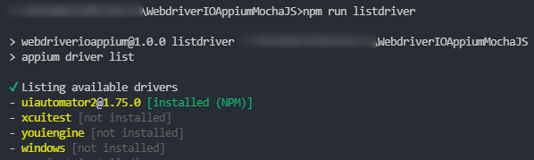
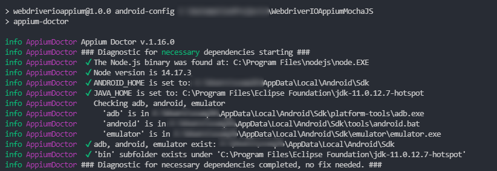

<h2 align="center"> Mobile Test Automation Framework | Appium | Java</h2>


### Requirements:
[](https://www.oracle.com/java/technologies/downloads/)
[](https://maven.apache.org/download.cgi)
[](https://nodejs.org/en/download/)
[](https://github.com/appium/appium-inspector/releases)
[](https://appiumpro.com/editions/122-installing-appium-20-and-the-driver-and-plugins-cli)
[](https://developer.android.com/studio)

### Getting Started:

#### Clone repository:
```bash
git clone https://github.com/sadabnepal/AppiumJavaTestNGFramework.git
Navigate to `AppiumJavaTestNGFramework`
```
#### Setup/Create virtual device on Android studio:
```
platformName: Android
platformVersion: 11
deviceName: Pixel 3
```
#### Install
```
npm i -g appium
npm i -g appium-doctor
```
#### Verify appium drivers:
```
appium driver list
```
uiautomator2 should be installed for android and xcuitest for ios<br/>


If drivers are not installed then run below command as required:
```
appium driver install uiautomator2  [for android]
appium driver install xcuitest [for ios]
```

#### Verify all pre-requisite for android:
```
npm run android-doctor
```
all options should be green checked as shown in below image to start.

